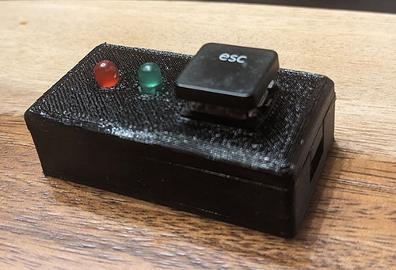

## What is this?

Keeps computer sessions active with some code for a Pi Pico and a case for it.  Mounts to the computer as an HID keyboard, sends a non used international keystroke to the computer 1-5 times, with a .1-.5 second delay, every 10-30 seconds.  It can be ran as just the microcontroller without the button/LEDs/case if the code is modified.

{ width=50% height=50% }

#### --Note that once code is loaded onto Pico, it will stop mounting as a storage device, so code cannot be modified unless a hard reset (found in troubleshooting) is performed.--
#### To disable this behavior, comment out lines in boot.py

#### Parts needed
1. 3d Printer
2. Pi Pico
3. 2 standard LEDs
4. 1 Mechanical Keyboard Switch
5. 2 resistors (I used 250 ohm)
6. Some wire

#### Printing the case:
1. Load pico_case_bottom and pico_case_top in your slicer
2. Generate the gcode, no supports needed
3. Print it

#### Soldering config:

1.  Solder resistor of choice to positive leg of LEDs if necessary
2.  Solder key blink LED to 3v3_en and GP2
3.  Solder status LED to 3v3_en and GP16
4.  Pull keyboard button wires through top of case, then solder to ground and GP28

#### Pi Pico config

1. Hold down button on Pi Pico, plug in while continuing to hold
2. While continuing to hold, wait for Pi to appear as a drive on computer
3. Move .uf2 in root of this repo to root of Pi Pico
4. Wait for device to reboot
5. Place all files found in Pico Files on root of Pi Pico

#### Troubleshooting

View serial monitor output by running a serial monitor on the COM port the device is connected to

Do a hard reset by connecting to the CircuitPython on the COM port the device is connected to, with speed 115200

If using PUTTY, set Serial Line to COM#, Speed 115200, Connection Type: Serial

    >>> import storage
    >>> storage.erase_filesystem()

If the keystroke causes issues, another key can be substituted.  keyboard_keys_hid.py has all variable to key mappings.
